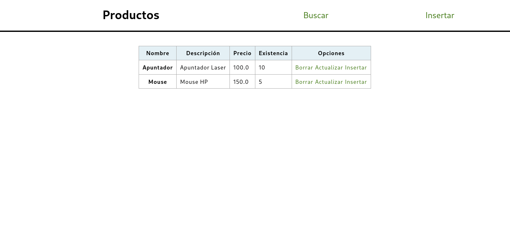

# CRUD en base a MVC
El siguiente repositorio almacena la práctica correspondiente a la realización de un CRUD
en base al patrón de diseño MVC (Modelo Vista Controlador) con el fin de aprender el funcionamiento,
metodología y manera de realización del mismo

# Iniciar Proyecto
Para iniciar el proyecto clona este repositorio:
```
git clone https://github.com/PatricioVargasR/CRUD-MVC.git
```
Luego ve a la carpeta que acaba de crear y en la raíz ejecuta:
```
python app.py

python3 app.py
```
Finalmente, visita http://0.0.0.0:8080/ en tu navegador preferido y deberías de ver algo como lo siguiente



# Estructura

* ## Views
  * layout.html: Layout principal que se encarga de "envolver" el contenido de las demás vistas.
  * lista_productos.html: Se renderizan los productos totales permitiendo acceder a todas las funciones posteriores.
  * buscar_productos.html: Uso de un formulario de busqueda basado en el texto que mostrará las coincidencias exactas o parecidas.
  * detalle_productos.html: Se muestra el producto seleccionado a detalle.
  * insertar_productos.html: Formulario para ingresar un nuevo producto en base a la estructura en la base de datos.
  * actualizar_productos.html: Muestra los datos en un formulario para que el usuario pueda modificarlos.
  * borrar_productos.html: Se muestra los datos del producto antes de ser eliminado, esto con el fin de evitar errores.

* ## Models:
  * modelo_productos.py: Archivo que contiene todas las operacones CRUD.

* ## Controllers:
  * lista_productos.py: Controlador que se encarga de obtener todos los productos de la base de datos, enviando a la vista correspondiente.
  * buscar_productos.py: Controlador que se encarga de obtener un parámetro de búsqueda y renderiza el producto(os) encontrados.
  * detalle_productos.py: Controlador que se encarga de obtener un producto y mostrar sus datos correspondientes.
  * insertar_productos.py: Controlador que se encarga de obtener los valores de entrada por un formulario y guardarlos en la base de datos.
  * actualizar_productos.py: Controlador que se encarga de obtener los datos de un producto y permitir la modificación de los mismos para ser almacenados nuevamente en la base de datos.
  * borrar_productos.py: Controlador que obtiene todos los datos del producto seleccionado para luego permitir ser eliminado de la base de datos

## Estructura del proyecto
```
├── app.py
├── icon.png
├── mvc
│   ├── controllers
│   │   ├── actualizar_productos.py
│   │   ├── borrar_productos.py
│   │   ├── buscar_productos.py
│   │   ├── detalle_productos.py
│   │   ├── insertar_productos.py
│   │   ├── lista_productos.py
│   ├── models
│   │   ├── modelo_productos.py
│   └── views
│       ├── actualizar_productos.html
│       ├── borrar_productos.html
│       ├── buscar_productos.html
│       ├── detalle_productos.html
│       ├── insertar_productos.html
│       ├── layout.html
│       └── lista_productos.html
├── productos.db
├── productos.sql
├── pruebas
│   └── prueba.png
└── README.md
```

***
** *Realizado por Patricio :f* **
